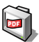
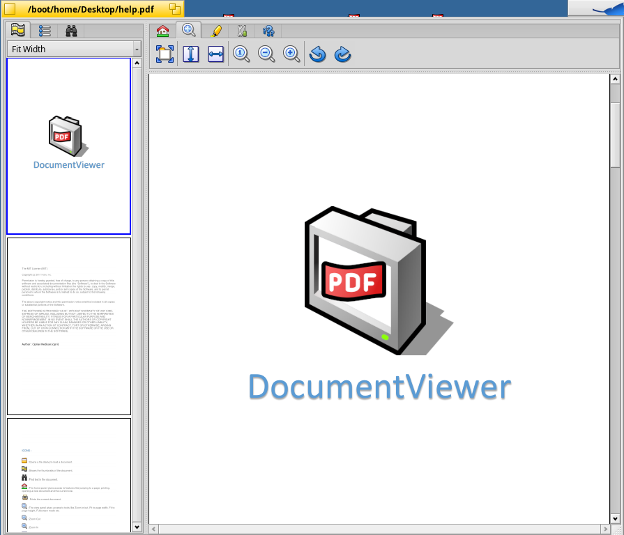

DocumentViewer
=

DocumentViewer is a viewer supporting PDF and DJVU files. 
It provides many features , making it easy to open and view documents. 

 
 Features include:
  * Opening a file dialog to load a document
  * Print document
  * View panel
  * Zooming in or out
  * Fitting the page length or width
  * Shows thumbnail
  * Find text
  * Home panel giving access to other feature
  * Options for help or to the website

